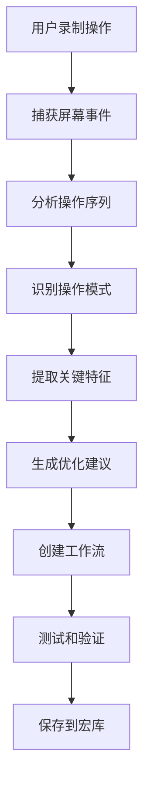

# CEOClaw 重新设计架构文档 v3.0 - 对齐 ClawX

## 产品定位变更

**原定位**: 聊天式 AI 助手
**新定位**: AI 驱动的桌面自动化平台

## 核心功能对标 ClawX

### 1. 录制和重放系统
- [x] 屏幕操作录制（鼠标点击、键盘输入、文本输入）
- [x] 操作序列重放
- [x] 录制编辑（添加、删除、修改操作）
- [x] 录制速度控制（正常、加速、减速）
- [x] 录制导出/导入

### 2. AI 学习和适应
- [x] 从演示中学习操作模式
- [x] UI 变化自适应（按钮位置变化、界面更新）
- [x] 智能元素识别（使用 OCR 和计算机视觉）
- [x] 操作优化建议

### 3. 工作流构建器
- [x] 可视化工作流编辑器
- [x] 节点化操作（点击、输入、等待、条件判断）
- [x] 工作流组合和嵌套
- [x] 变量和参数传递
- [x] 条件分支和循环
- [x] 错误处理和重试

### 4. 宏库管理
- [x] 宏分类和标签
- [x] 宏搜索和过滤
- [x] 宏共享和导入
- [x] 宏使用统计
- [x] 云端同步（可选）

### 5. 触发器系统
- [x] 时间触发（定时、计划）
- [x] 事件触发（文件变化、窗口变化）
- [x] 快捷键触发
- [x] 条件触发（满足特定条件）
- [x] 外部触发（Webhook/API）

### 6. 应用集成
- [x] 应用程序选择和启动
- [x] 窗口管理（定位、大小、焦点）
- [x] 多应用协调
- [x] 跨应用数据传递

## 技术架构

### 前端架构
```
src/
├── main.tsx                      # 应用入口
├── App.tsx                       # 根组件
├── components/
│   ├── Recorder/                 # 录制界面
│   │   ├── ControlPanel.tsx      # 控制面板（开始/停止/暂停）
│   │   ├── PreviewPanel.tsx      # 预览面板
│   │   └── Timeline.tsx          # 时间轴编辑器
│   ├── Workflow/                 # 工作流界面
│   │   ├── WorkflowBuilder.tsx   # 工作流构建器
│   │   ├── NodeEditor.tsx        # 节点编辑器
│   │   └── PropertiesPanel.tsx   # 属性面板
│   ├── MacroLibrary/             # 宏库界面
│   │   ├── MacroList.tsx         # 宏列表
│   │   ├── MacroCard.tsx         # 宏卡片
│   │   └── CategoryFilter.tsx    # 分类过滤
│   ├── Triggers/                 # 触发器界面
│   │   ├── TriggerList.tsx       # 触发器列表
│   │   ├── TriggerEditor.tsx     # 触发器编辑器
│   │   └── ScheduleEditor.tsx    # 计划编辑器
│   ├── Dashboard/                # 仪表盘
│   │   ├── StatsPanel.tsx        # 统计面板
│   │   ├── RecentActivity.tsx    # 最近活动
│   │   └── QuickActions.tsx      # 快捷操作
│   └── Settings/                 # 设置面板
│       ├── GeneralSettings.tsx   # 通用设置
│       ├── RecordingSettings.tsx # 录制设置
│       └── AIModelSettings.tsx   # AI 模型设置
├── store/
│   ├── recorder.ts               # 录制状态管理
│   ├── workflow.ts               # 工作流状态管理
│   ├── macro.ts                  # 宏状态管理
│   ├── trigger.ts                # 触发器状态管理
│   └── app.ts                    # 应用状态管理
├── hooks/
│   ├── useRecorder.ts            # 录制 Hook
│   ├── useWorkflow.ts            # 工作流 Hook
│   ├── useMacro.ts               # 宏 Hook
│   └── useTrigger.ts             # 触发器 Hook
├── types/
│   ├── recorder.ts               # 录制类型定义
│   ├── workflow.ts               # 工作流类型定义
│   ├── macro.ts                  # 宏类型定义
│   ├── trigger.ts                # 触发器类型定义
│   └── ai.ts                     # AI 类型定义
└── utils/
    ├── screenCapture.ts          # 屏幕捕获
    ├── eventRecorder.ts          # 事件录制
    ├── player.ts                 # 重放器
    └── aiProcessor.ts            # AI 处理器
```

### 后端架构
```
src-tauri/src/
├── main.rs                       # 应用入口
├── lib.rs                        # 库入口
├── recorder/                     # 录制系统
│   ├── mod.rs
│   ├── capture.rs                # 屏幕捕获
│   ├── event_listener.rs         # 事件监听
│   ├── event_serializer.rs       # 事件序列化
│   └── editor.rs                 # 录制编辑
├── player/                       # 重放系统
│   ├── mod.rs
│   ├── executor.rs               # 执行器
│   ├── speed_control.rs          # 速度控制
│   └── error_handler.rs          # 错误处理
├── workflow/                     # 工作流系统
│   ├── mod.rs
│   ├── builder.rs                # 工作流构建器
│   ├── executor.rs               # 工作流执行器
│   ├── optimizer.rs              # 优化器
│   └── validator.rs              # 验证器
├── macro/                        # 宏系统
│   ├── mod.rs
│   ├── library.rs                # 宏库
│   ├── parser.rs                 # 宏解析器
│   └── exporter.rs               # 宏导出器
├── trigger/                      # 触发器系统
│   ├── mod.rs
│   ├── scheduler.rs              # 调度器
│   ├── event_monitor.rs          # 事件监控
│   └── action_dispatcher.rs      # 动作分发器
├── ai/                           # AI 系统
│   ├── mod.rs
│   ├── visual_processor.rs       # 视觉处理器（OCR/CV）
│   ├── pattern_recognizer.rs     # 模式识别器
│   ├── adaptive_engine.rs        # 自适应引擎
│   └── optimizer.rs              # 优化建议
├── integration/                  # 应用集成
│   ├── mod.rs
│   ├── window_manager.rs         # 窗口管理
│   ├── app_launcher.rs           # 应用启动器
│   └── coordinator.rs            # 协调器
├── commands/                     # Tauri 命令
│   ├── recorder.rs               # 录制命令
│   ├── workflow.rs               # 工作流命令
│   ├── macro.rs                  # 宏命令
│   ├── trigger.rs                # 触发器命令
│   ├── ai.rs                     # AI 命令
│   └── integration.rs            # 集成命令
└── db/                           # 数据库
    ├── mod.rs
    ├── connection.rs             # 连接管理
    ├── schema.rs                 # 数据库架构
    └── models.rs                 # 数据模型
```

## 数据库架构

### 录制表
```sql
CREATE TABLE recordings (
    id TEXT PRIMARY KEY,
    name TEXT NOT NULL,
    description TEXT,
    events TEXT NOT NULL,              -- JSON 格式的事件序列
    duration_ms INTEGER,
    screenshot_paths TEXT,             -- JSON 数组
    created_at TEXT,
    updated_at TEXT
);
```

### 工作流表
```sql
CREATE TABLE workflows (
    id TEXT PRIMARY KEY,
    name TEXT NOT NULL,
    description TEXT,
    nodes TEXT NOT NULL,               -- JSON 格式的节点数据
    edges TEXT NOT NULL,               -- JSON 格式的边数据
    variables TEXT,                    -- JSON 格式的变量定义
    created_at TEXT,
    updated_at TEXT
);
```

### 宏表
```sql
CREATE TABLE macros (
    id TEXT PRIMARY KEY,
    name TEXT NOT NULL,
    description TEXT,
    category TEXT,
    tags TEXT,                         -- JSON 数组
    workflow_id TEXT,                  -- 关联的工作流
    use_count INTEGER DEFAULT 0,
    created_at TEXT,
    updated_at TEXT,
    FOREIGN KEY (workflow_id) REFERENCES workflows(id)
);
```

### 触发器表
```sql
CREATE TABLE triggers (
    id TEXT PRIMARY KEY,
    name TEXT NOT NULL,
    type TEXT NOT NULL,                -- time, event, shortcut, condition
    config TEXT NOT NULL,              -- JSON 格式的触发器配置
    macro_id TEXT NOT NULL,            -- 触发的宏
    enabled INTEGER DEFAULT 1,
    last_triggered TEXT,
    created_at TEXT,
    updated_at TEXT,
    FOREIGN KEY (macro_id) REFERENCES macros(id)
);
```

## 事件数据结构

```typescript
interface Event {
    id: string;
    type: 'click' | 'keypress' | 'text' | 'wait' | 'scroll' | 'drag';
    timestamp: number;
    data: {
        // 鼠标点击
        x?: number;
        y?: number;
        button?: number;
        target?: string;              // 目标元素识别

        // 键盘输入
        key?: string;
        code?: string;
        modifiers?: string[];

        // 文本输入
        text?: string;

        // 等待
        duration?: number;

        // 滚动
        deltaX?: number;
        deltaY?: number;

        // 拖拽
        startX?: number;
        startY?: number;
        endX?: number;
        endY?: number;
    };
    screenshot?: string;             // 截图 Base64
}
```

## 工作流节点类型

```typescript
type NodeType =
    | 'click'          // 鼠标点击
    | 'type'           // 文本输入
    | 'wait'           // 等待
    | 'loop'           // 循环
    | 'condition'      // 条件判断
    | 'switch'         // 分支
    | 'screenshot'     // 截图
    | 'ocr'            // OCR 识别
    | 'variable'       // 变量操作
    | 'api_call'       // API 调用
    | 'sub_workflow';  // 子工作流
```

## AI 处理流程



## 实施计划

### Phase 1: 录制和重放系统（2-3 周）
- [ ] 屏幕事件监听和捕获
- [ ] 事件序列化和存储
- [ ] 操作重放引擎
- [ ] 录制编辑器
- [ ] 基础 UI

### Phase 2: 工作流构建器（2-3 周）
- [ ] 节点化工作流模型
- [ ] 可视化编辑器
- [ ] 变量和参数系统
- [ ] 条件分支和循环
- [ ] 工作流执行器

### Phase 3: AI 学习系统（2-3 周）
- [ ] 屏幕内容识别（OCR/CV）
- [ ] 操作模式学习
- [ ] UI 自适应引擎
- [ ] 优化建议生成
- [ ] 智能元素识别

### Phase 4: 宏库和触发器（1-2 周）
- [ ] 宏库管理
- [ ] 触发器系统
- [ ] 云端同步（可选）
- [ ] 分享和导入

### Phase 5: 应用集成（1-2 周）
- [ ] 窗口管理
- [ ] 应用启动
- [ ] 跨应用协调

## 与原 CEOClaw 的差异

| 功能 | 原 CEOClaw | 新 CEOClaw（对齐 ClawX） |
|------|-----------|--------------------------|
| 主要交互方式 | 聊天对话 | 录制重放 + 可视化编辑 |
| 核心能力 | AI 回答和命令执行 | 桌面操作自动化 |
| 用户群体 | 技术用户 | 非技术用户 |
| 学习曲线 | 高（需要熟悉命令） | 低（录制即可） |
| 可扩展性 | 插件系统 | 工作流组合 |
| UI 复杂度 | 简单 | 复杂（可视化编辑器） |

CEOClaw 将完全转变为 AI 驱动的桌面自动化平台，重点放在录制、重放、工作流构建和智能学习上。